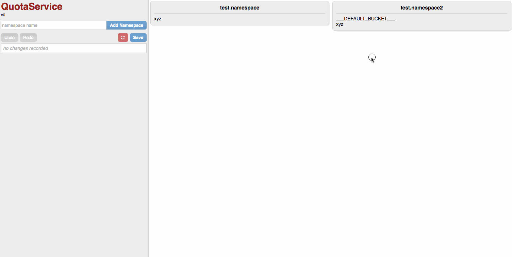
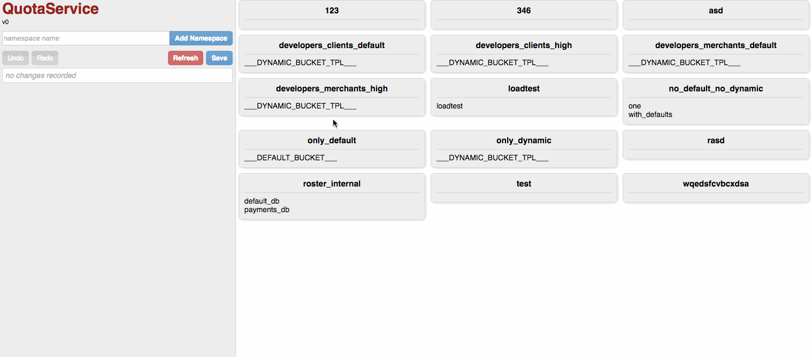

### Quotaservice UI




#### How?


For development, as long as your QuotaService is running the admin API at port 8080, you can use the following.

```
$ nvm use
Now using node v6.3.1 (npm v3.10.3)
$ npm install
...
$ npm run start
```

Visiting localhost:3000 will enable you to develop the UI application with code reloading.

For a production, minified version:

```
$ npm run dist
```

For code linting:

```
$ npm run lint
```

#### TODO

* proper testing
